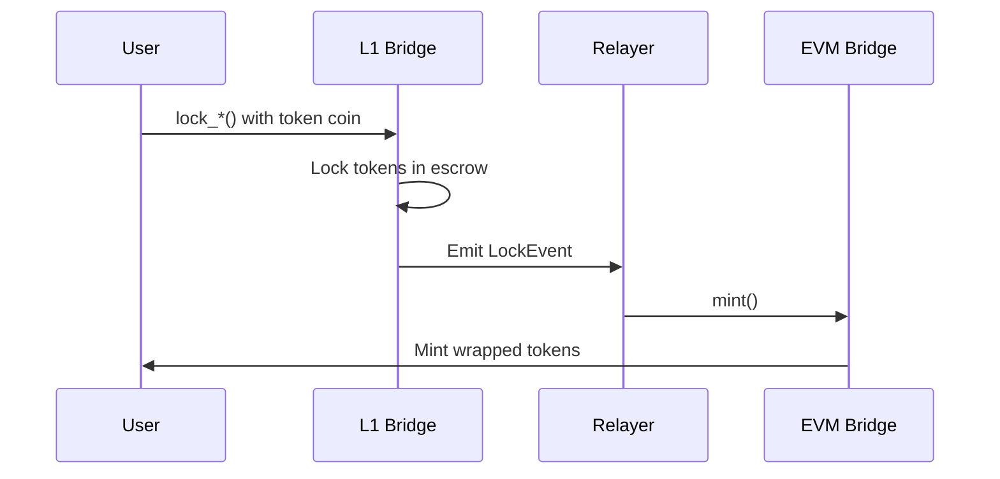
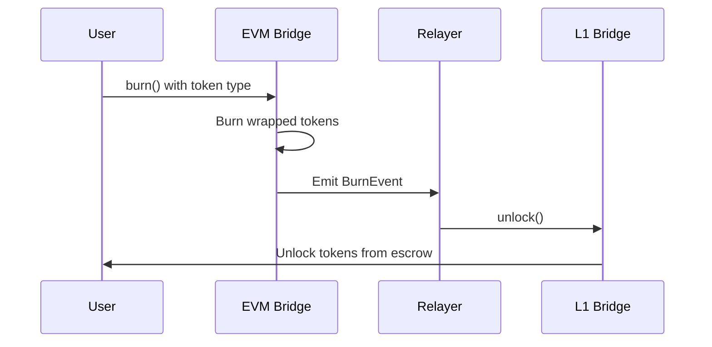

# StableX - Cross-Chain Stablecoin Exchange on IOTA

> A cross-chain stablecoin exchange platform built on IOTA, supporting both IOTA L1 (Move) and IOTA EVM (Solidity). The exchange addresses fragmented liquidity for regional stablecoins by allowing users to deposit USDC or regional stablecoins, earn unified yield, and receive SBX tokens that can be withdrawn as any currency (with asymmetric withdrawal rules).

---

## 📋 Table of Contents

- [Project Overview](#project-overview)
- [Core Features](#core-features)
- [Architecture](#architecture)
- [Quick Start](#quick-start)
- [Network & Deployment](#network--deployment)
- [Development Status](#development-status)
- [Future Enhancements](#-future-enhancements)
- [Dependencies](#dependencies)
- [References](#references)

---

## 🎯 Project Overview

### Concept

StableX implements a **unified liquidity pool** that aggregates multiple regional stablecoins into a single basket, enabling:

| Feature | Description |
|---------|-------------|
| **Unified Basket** | All currencies (USDC + CHFX + TRYB + SEKX) in one pool |
| **SBX Token** | Single fungible token (1 SBX = 1 USD) with rebasing mechanism |
| **Unified APY** | All depositors earn the same APY (higher than USDC alone) |
| **Asymmetric Withdrawal** | Regional depositors can withdraw USDC or regionals; USDC depositors can only withdraw regionals |
| **Cross-Chain Support** | Operates on both IOTA L1 and IOTA EVM with unified liquidity |

### User Capabilities

Users deposit USDC or regional stablecoins to earn unified yield, receive SBX tokens (1 SBX = 1 USD), and can:

- **Regional depositors**: Withdraw any regional stablecoin OR USDC
- **USDC depositors**: Withdraw any regional stablecoin (cannot withdraw USDC)
- Swap directly between regional stablecoins (A→B, no USD intermediate)
- Bridge tokens between IOTA L1 and IOTA EVM
- All withdrawals subject to dynamic fees based on pool depth

### Multi-Chain Architecture

#### IOTA L1 (Move-based)
- **Native tokens**: CHFX, TRYB, SEKX, USDC, SBX
- **Pool contract**: `sbx_pool.move`
- **Bridge contract**: `bridge_l1.move` (locks/unlocks tokens)

#### IOTA EVM (Solidity-based)
- **ERC-20 tokens**: CHFX, TRYB, SEKX, USDC, wSBX (wrapped SBX)
- **Pool contract**: `StableXPool.sol`
- **Bridge contract**: `EVMBridge.sol` (mints/burns wrapped tokens)

#### Cross-Chain Bridge
- **Lock/Mint**: L1 tokens locked → EVM wrapped tokens minted
- **Burn/Unlock**: EVM wrapped tokens burned → L1 tokens unlocked
- **Relayer service**: Monitors events and facilitates transfers

### Price Feed Architecture

- **API-Based Price Feeds**: Prices are queried off-chain via API and passed as parameters to contract functions
- **No Onchain Queries**: Removed dependency on Pyth Network onchain queries for better flexibility and lower gas costs
- **Price Format**: All prices in micro-USD (1e6 = $1.00)

### Key Features

- ✅ **Staking**: Multi-currency support (USDC, CHFX, TRYB, SEKX) on both L1 and EVM
- ✅ **Swapping**: Direct swaps between regional stablecoins on both chains
- ✅ **Bridging**: Cross-chain token transfers between L1 and EVM
- ✅ **Dynamic Currency Modal**: Shows L1 or EVM tokens based on connected wallet
- ✅ **Real-time Prices**: Fetches prices from API
- ✅ **Fee Calculation**: Real-time fee calculation with depth-aware fees
- ✅ **Transaction Status**: Snackbar notifications with correct explorer links (L1 or EVM)
- ✅ **Balance Refresh**: Automatic balance updates after transactions

---

## ⚡ Core Features

### 1. Three-Tier Fee Curve (80%/30% Thresholds)

| Tier | Coverage | Fee Structure | Example |
|------|----------|---------------|---------|
| **Tier 1** | ≥80% | Fixed cheap rate: `floor + base` (no deviation penalty) | 7 bps (0.07%) - optimal for healthy pools |
| **Tier 2** | 30-80% | Linear fee: `floor + base + k * deviation` | 7-32 bps range |
| **Tier 3** | <30% | Dramatic increase: `(floor + base) * 10x + exponential` | 77 bps at 29%, up to 1432 bps at 1% |

> **Note**: Tier 3 has **no cap** - fees can exceed 14%+ to discourage draining

### 2. Direct A→B Swaps (Infinity Pool Core)

- **No USD intermediate** - direct exchange between regional stablecoins
- **Rate calculation**: `rate_A_to_B = price_B / price_A` (both in USD/[CURRENCY] format)
- **Single fee** applied based on target asset depth
- **True infinity pool mechanics** - all assets in one unified pool
- **Prices passed as parameters** - queried from API off-chain before transaction

### 3. Cross-Chain Functionality

#### Unified Global Liquidity Pool
- Separate pools on L1 and EVM, bridged via cross-chain transfers
- Users can access liquidity from either chain

#### Multi-Chain Regional Stablecoin Access
- Stake, swap, and withdraw on either L1 or EVM
- Bridge tokens between chains as needed

#### Cross-Chain Swaps
- Bridge tokens from one chain, then swap on the destination chain
- Seamless user experience across chains

### 4. Multi-Wallet Support

#### Dual Wallet Connection
- **IOTA L1 Wallet**: Connect via IOTA dApp Kit
- **EVM Wallet**: Connect via RainbowKit (MetaMask, WalletConnect, etc.)
- Both wallets can be connected simultaneously
- Frontend automatically routes to correct contracts based on connected wallet

#### Dynamic UI
- CurrencyModal adapts to show L1 or EVM tokens based on connected wallet
- Transaction snackbars show correct explorer links (L1 or EVM)
- Wallet type indicators throughout the UI

---

## 📦 Package Information

### Latest L1 Package

| Property | Value |
|----------|-------|
| **Package ID** | [`0x1cf79de8cac02b52fa384df41e7712b5bfadeae2d097a818008780cf7d7783c6`](https://explorer.iota.org/package/0x1cf79de8cac02b52fa384df41e7712b5bfadeae2d097a818008780cf7d7783c6?network=testnet) |
| **Network** | IOTA Testnet |
| **Pool Object ID** | [`0x8587158f53289362bb94530c6e174ae414e6eea32c9400cfc6da2704e80c5517`](https://explorer.iota.org/object/0x8587158f53289362bb94530c6e174ae414e6eea32c9400cfc6da2704e80c5517?network=testnet) (Shared) |
| **Registry Object ID** | [`0xb1e480f286dfb4e668235acca148be2ec901aedeed62d79aa4a1e5d01642c4ad`](https://explorer.iota.org/object/0xb1e480f286dfb4e668235acca148be2ec901aedeed62d79aa4a1e5d01642c4ad?network=testnet) (Shared) |
| **Modules** | `chfx`, `tryb`, `sekx`, `sbx`, `sbx_pool`, `usdc`, `flash_vault`, `bridge_l1`, `jpyc`, `myrc`, `xsgd` |

### EVM Contracts (IOTA EVM Testnet)

#### Network Information

| Property | Value |
|----------|-------|
| **Network** | IOTA EVM Testnet |
| **Chain ID** | 1076 |
| **RPC URL** | `https://json-rpc.evm.testnet.iota.cafe` |
| **Explorer** | `https://explorer.evm.testnet.iotaledger.net/` |

#### Deployed Contracts

| Contract | Address |
|----------|---------|
| **CHFX** | [`0x956Cc9A9a71347b0d392D49DAdD49b4dC74b21bE`](https://explorer.evm.testnet.iotaledger.net/address/0x956Cc9A9a71347b0d392D49DAdD49b4dC74b21bE) |
| **TRYB** | [`0x00f791a9E86f58Af72179b432b060FD1C40b8268`](https://explorer.evm.testnet.iotaledger.net/address/0x00f791a9E86f58Af72179b432b060FD1C40b8268) |
| **SEKX** | [`0x00fec4B374a0B74B4718AfefD41dB07469d85A71`](https://explorer.evm.testnet.iotaledger.net/address/0x00fec4B374a0B74B4718AfefD41dB07469d85A71) |
| **USDC** | [`0x34E1C1F3CFAa76C058eB6B7e77b0F81e1E6aB61f`](https://explorer.evm.testnet.iotaledger.net/address/0x34E1C1F3CFAa76C058eB6B7e77b0F81e1E6aB61f) |
| **wSBX** | [`0x06812Ea1244a72dbBD581831B886F6F08b4475f5`](https://explorer.evm.testnet.iotaledger.net/address/0x06812Ea1244a72dbBD581831B886F6F08b4475f5) |
| **EVMBridge** | [`0x5bEACC92487733898E786138410E8AC9486CC418`](https://explorer.evm.testnet.iotaledger.net/address/0x5bEACC92487733898E786138410E8AC9486CC418) |
| **StableXPool** | [`0x0Bd0C0F30b84007fcDC44756E077BbF91d12b48d`](https://explorer.evm.testnet.iotaledger.net/address/0x0Bd0C0F30b84007fcDC44756E077BbF91d12b48d) |

---

## 🖥️ Frontend dApp

The frontend is a Next.js application with full multi-chain wallet integration.

### Wallet Support

- **IOTA L1**: IOTA dApp Kit integration with wallet persistence
- **EVM**: RainbowKit integration (MetaMask, WalletConnect, etc.)
- **Dual Connection**: Both wallets can be connected simultaneously
- **Auto-Routing**: Frontend automatically uses correct contracts based on connected wallet

### Environment Variables

Create `frontend/.env.local`:

```env
# L1 Contracts
NEXT_PUBLIC_POOL_OBJECT_ID=0x8587158f53289362bb94530c6e174ae414e6eea32c9400cfc6da2704e80c5517
NEXT_PUBLIC_REGISTRY_OBJECT_ID=0xb1e480f286dfb4e668235acca148be2ec901aedeed62d79aa4a1e5d01642c4ad

# EVM Contracts
NEXT_PUBLIC_EVM_BRIDGE_ADDRESS=0x5bEACC92487733898E786138410E8AC9486CC418
NEXT_PUBLIC_EVM_POOL_ADDRESS=0x0Bd0C0F30b84007fcDC44756E077BbF91d12b48d
NEXT_PUBLIC_EVM_RPC_URL=https://json-rpc.evm.testnet.iota.cafe

# WalletConnect (optional, for EVM wallets)
NEXT_PUBLIC_WALLETCONNECT_PROJECT_ID=your_project_id_here
```

---

## 🏗️ Architecture

### L1 Modules (Move)

#### 1. `sbx_pool.move` - Core pool logic
- Unified basket: All currencies (USDC + regionals) in one pool
- Asymmetric withdrawal: Regional depositors can withdraw USDC; USDC depositors cannot
- Unified APY: All depositors earn the same APY (weighted average)
- Three-tier fee curve (80%/30% thresholds)
- Direct A→B swaps (no USD intermediate)
- API-based price feeds

#### 2. `bridge_l1.move` - L1 side of cross-chain bridge
- Locks tokens in escrow for EVM bridging
- Unlocks tokens when EVM burns are verified
- Nonce system to prevent replay attacks
- Event emission for relayer

#### 3. `flash_vault.move` - Flash loan vault module
- Flash loan mechanism: Borrow USDC, use it, repay in same transaction
- Reentrancy protection
- Shared object design for multi-user access

#### 4. Token modules
- `chfx.move`, `tryb.move`, `sekx.move`, `usdc.move`, `sbx.move`
- Regulated currency creation
- Mint/transfer functions
- Balance queries

### EVM Contracts (Solidity)

#### 1. `StableXPool.sol` - EVM pool contract
- Mirrors L1 pool functionality
- Staking: `stakeUSDC`, `stakeCHFX`, `stakeTRYB`, `stakeSEKX`
- Unstaking: `unstakeUSDC`, `unstakeCHFX`, `unstakeTRYB`, `unstakeSEKX`
- Swapping: `swapRegional` (direct A→B swaps)
- Uses wSBX for SBX representation

#### 2. `EVMBridge.sol` - EVM side of cross-chain bridge
- Mints wrapped tokens when L1 tokens are locked
- Burns wrapped tokens to unlock on L1
- Nonce system to prevent replay attacks
- Event emission for relayer

#### 3. `wSBX.sol` - Wrapped SBX token (ERC-20)
- Can be minted/burned by bridge or pool
- 6 decimals (matching SBX on L1)

#### 4. Token contracts
- `CHFX.sol`, `TRYB.sol`, `SEKX.sol`, `USDC.sol`
- Standard ERC-20 tokens
- Mint/burn functions for bridge and pool

### Bridge Relayer

**Location:** `bridge-relayer/`

A Node.js/TypeScript service that:
- Watches L1 `LockEvent`s → calls EVM `mint()`
- Watches EVM `BurnEvent`s → calls L1 `unlock()`
- For POC: uses event-based verification

**Setup:**

```bash
cd bridge-relayer
npm install
cp .env.example .env
# Edit .env with your configuration
npm run start
```

---

## 🌉 Cross-Chain Bridge Flow

### L1 → EVM (Lock → Mint)



1. User calls `bridge_l1::lock_*()` on L1 with token coin and recipient EVM address
2. L1 bridge locks tokens in escrow and emits `LockEvent`
3. Relayer watches L1 events and calls `EVMBridge::mint()` on EVM
4. EVM bridge mints wrapped tokens to recipient

### EVM → L1 (Burn → Unlock)



1. User calls `EVMBridge::burn()` on EVM with token type, amount, and recipient L1 address
2. EVM bridge burns wrapped tokens and emits `BurnEvent`
3. Relayer watches EVM events and calls `bridge_l1::unlock()` on L1
4. L1 bridge unlocks tokens from escrow and transfers to recipient

---

## 🚀 Quick Start

### Frontend Development

```bash
cd frontend
npm install
npm run dev
```

The dApp will be available at `http://localhost:3000`

### L1 Contract Development

```bash
cd first_package
iota move build
iota client publish
```

### EVM Contract Development

```bash
cd evm_contracts
npm install
npx hardhat compile
npx hardhat run scripts/deploy-testnet.js --network iota-evm-testnet
```

### Bridge Relayer

```bash
cd bridge-relayer
npm install
cp .env.example .env
# Edit .env with your configuration
npm run start
```

---

## 🌐 Network & Deployment

### IOTA L1 Testnet

| Property | Value |
|----------|-------|
| **Network** | IOTA Testnet |
| **Explorer** | [IOTA Explorer](https://explorer.iota.org/?network=testnet) |
| **Package ID** | [`0x1cf79de8cac02b52fa384df41e7712b5bfadeae2d097a818008780cf7d7783c6`](https://explorer.iota.org/package/0x1cf79de8cac02b52fa384df41e7712b5bfadeae2d097a818008780cf7d7783c6?network=testnet) |
| **Pool Object** | [`0x8587158f53289362bb94530c6e174ae414e6eea32c9400cfc6da2704e80c5517`](https://explorer.iota.org/object/0x8587158f53289362bb94530c6e174ae414e6eea32c9400cfc6da2704e80c5517?network=testnet) (Shared) |
| **Registry Object** | [`0xb1e480f286dfb4e668235acca148be2ec901aedeed62d79aa4a1e5d01642c4ad`](https://explorer.iota.org/object/0xb1e480f286dfb4e668235acca148be2ec901aedeed62d79aa4a1e5d01642c4ad?network=testnet) (Shared) |

### IOTA EVM Testnet

| Property | Value |
|----------|-------|
| **Network** | IOTA EVM Testnet |
| **Chain ID** | 1076 |
| **RPC URL** | `https://json-rpc.evm.testnet.iota.cafe` |
| **Explorer** | [IOTA EVM Explorer](https://explorer.evm.testnet.iotaledger.net/) |
| **Contract Addresses** | See `evm_contracts/DEPLOYED_ADDRESSES.txt` |

---

## ✅ Development Status

### Production Ready - Multi-Chain Support

#### Core Features ✅

| Feature | Status | Description |
|---------|--------|-------------|
| **Staking** | ✅ | Multi-currency staking on both L1 and EVM |
| **Swapping** | ✅ | Direct A→B swaps on both chains |
| **Bridging** | ✅ | Cross-chain token transfers |
| **Multi-Wallet** | ✅ | Support for both IOTA L1 and EVM wallets |
| **Unified Basket** | ✅ | All currencies in one pool per chain |
| **Shared Objects** | ✅ | Pool and Registry created as shared objects (L1) |
| **Asymmetric Withdrawal** | ✅ | Regional depositors can withdraw USDC; USDC depositors cannot |
| **Unified APY** | ✅ | All depositors earn the same APY |
| **Flash Loan Vault** | ✅ | Real flash loan functionality (L1) |
| **Frontend dApp** | ✅ | Complete Next.js application with multi-chain support |
| **Dynamic UI** | ✅ | CurrencyModal and transaction handling adapt to wallet type |

#### Technical Implementation ✅

- ✅ Token creation (CHFX, TRYB, SEKX, USDC, SBX on L1)
- ✅ ERC-20 token deployment (CHFX, TRYB, SEKX, USDC, wSBX on EVM)
- ✅ Cross-chain bridge contracts (L1 and EVM)
- ✅ Pool contracts on both chains
- ✅ API-based price feed integration
- ✅ Three-tier fee curve (80%/30% thresholds)
- ✅ Direct A→B swaps (no USD intermediate)
- ✅ Multi-wallet frontend integration
- ✅ Bridge relayer service

---

## 🚀 Future Enhancements

### 1. Additional Regional Stablecoins

Expand support to more regional currencies to increase global accessibility and liquidity:

- **Target Currencies**: JPYX (Japanese Yen), GBPX (British Pound), AUDX (Australian Dollar), CADX (Canadian Dollar), and more
- **Enhanced Multi-Currency Pools**: Support for 10+ regional stablecoins in unified liquidity pool
- **Regional Market Features**: Currency-specific features tailored to local market needs
- **Regulatory Compliance**: Ensure each currency meets regional regulatory requirements

**Implementation Requirements:**
- New token modules (Move) and ERC-20 contracts (EVM)
- Price feed integration for new currency pairs
- Frontend updates for currency selection and swaps
- Extended fee tracking and allocation logic per currency

---

### 2. Enhanced Yield Strategies

Implement automated yield generation across multiple DeFi protocols:

- **Automated Yield Farming**: Integrate with lending protocols, DEXs, and yield aggregators
- **Multi-Strategy Vault**: Allocate funds across multiple strategies based on risk/return profiles
- **Auto-Compounding**: Automatically reinvest yields to maximize returns
- **Strategy Performance Tracking**: Real-time APY tracking per strategy with historical analytics
- **Risk Management**: Slippage controls, impermanent loss protection, and strategy rebalancing

**Potential Integrations:**
- Lending protocols (Aave, Compound-style)
- Liquidity provision on DEXs
- Staking rewards on other chains
- Cross-chain yield opportunities

---

### 3. Improved Drain Prevention Mechanism

Enhance the current fee-based protection with multi-layered security:

#### Current System
- Two-tier fee structure: 5 bps base, 40-50% high fees when pool >70% utilized or withdrawal >30%

#### Planned Improvements

**Three-Tier Fee Curve (80%/30% Thresholds):**
- **Tier 1 (≥80% coverage)**: Fixed 7 bps (0.07%) - optimal for healthy pools
- **Tier 2 (30-80% coverage)**: Linear scaling 7-32 bps - gradual fee increase
- **Tier 3 (<30% coverage)**: Exponential fees with no cap (up to 14%+) - strong deterrent

**Additional Protection Mechanisms:**
- **Time-Based Limits**: Cooldown periods for large withdrawals
- **Rate Limiting**: Maximum withdrawal amounts per time window
- **Circuit Breakers**: Automatic pause mechanism if pool drops below critical threshold
- **Dynamic Thresholds**: Adaptive fee thresholds based on historical patterns
- **Multi-Factor Analysis**: Combine depth, velocity, and time-based metrics
- **Flash Loan Attack Prevention**: Detect and prevent arbitrage-based drain attempts

**Benefits:**
- More granular protection at different pool health levels
- Better user experience for normal operations (lower fees when healthy)
- Stronger protection against coordinated attacks
- Per-currency depth tracking for precise fee calculation

---

### 4. Payment/Offramp Protocol Integration

Enable real-world usage through partnerships with payment processors and offramp services:

#### Payment Processor Integration
- **Merchant Acceptance**: Enable businesses to accept regional stablecoins as payment
- **Point-of-Sale Integration**: Connect with payment terminals and e-commerce platforms
- **API Endpoints**: Provide payment APIs for third-party integrations
- **Settlement Mechanisms**: Fast, low-cost settlement for merchants

#### Offramp Services
- **Fiat Conversion**: Convert SBX and regional stablecoins to local fiat currencies
- **Bank Transfers**: Direct bank account integration for withdrawals
- **Card Issuance**: Debit/credit cards linked to SBX balances
- **ATM Network**: Physical access to funds via ATM networks

#### Remittance & B2B Services
- **Cross-Border Payments**: Low-cost international remittances
- **Corporate Treasury**: B2B payment solutions for businesses
- **Multi-Currency Wallets**: Support for businesses operating in multiple regions

**Technical Requirements:**
- Webhook system for payment notifications
- KYC/AML compliance integration
- Fiat on/off-ramp smart contracts
- Multi-signature security for large transactions
- Transaction monitoring and fraud detection
- Compliance reporting and audit trails

**Partnership Opportunities:**
- Payment processors (Stripe, PayPal-style integrations)
- Offramp providers (MoonPay, Ramp-style services)
- Card issuers (Visa, Mastercard partnerships)
- Remittance services (Western Union, MoneyGram-style)
- Banking partners for fiat integration

---

## 📚 Dependencies

### Frontend

| Package | Purpose |
|---------|---------|
| `@iota/dapp-kit` | IOTA L1 wallet integration |
| `@rainbow-me/rainbowkit` | EVM wallet integration |
| `wagmi` | Ethereum React Hooks |
| `viem` | TypeScript interface for Ethereum |
| `ethers` | Ethereum JavaScript library |
| `@tanstack/react-query` | Data fetching and state management |
| `next` | Next.js framework |
| `react` | React library |

### EVM Contracts

| Package | Purpose |
|---------|---------|
| `@openzeppelin/contracts` | Secure smart contract libraries |
| `hardhat` | Ethereum development environment |

### Bridge Relayer

| Package | Purpose |
|---------|---------|
| `@iota/iota-sdk` | IOTA SDK for L1 interactions |
| `ethers` | Ethereum JavaScript library |
| `typescript` | TypeScript support |

---

## 📖 References

- **[IOTA Documentation](https://docs.iota.org/)** - Official IOTA documentation
- **[IOTA EVM Documentation](https://docs.iota.org/developer/iota-evm/)** - IOTA EVM developer guide
- **[Move Language](https://move-language.github.io/move/)** - Move programming language documentation
- **[Solidity Documentation](https://docs.soliditylang.org/)** - Solidity programming language documentation

---

## 📝 Key Transactions

### L1 Package
- **Package ID:** [`0x1cf79de8cac02b52fa384df41e7712b5bfadeae2d097a818008780cf7d7783c6`](https://explorer.iota.org/package/0x1cf79de8cac02b52fa384df41e7712b5bfadeae2d097a818008780cf7d7783c6?network=testnet)
- **Published:** Latest version with cross-chain bridge support, shared objects, unified basket architecture

### EVM Contracts
- **Deployed:** All token contracts, bridge, and pool contracts on IOTA EVM Testnet
- **Network:** IOTA EVM Testnet (Chain ID: 1076)
- **Explorer:** [IOTA EVM Explorer](https://explorer.evm.testnet.iotaledger.net/)
